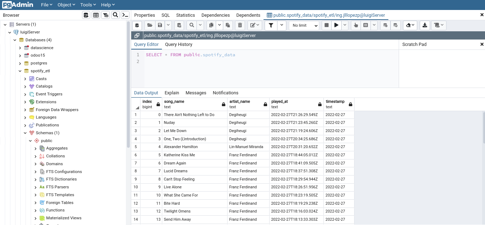

# spotify_etl
This is a script that gets the recently listened songs in the last 24 hrs on spotify, apply some conditions to that data, and upload it in a postgresql local database 

We use the Spotify API
https://developer.spotify.com/console/get-recently-played/?limit=50&after=1596299315000&before=

